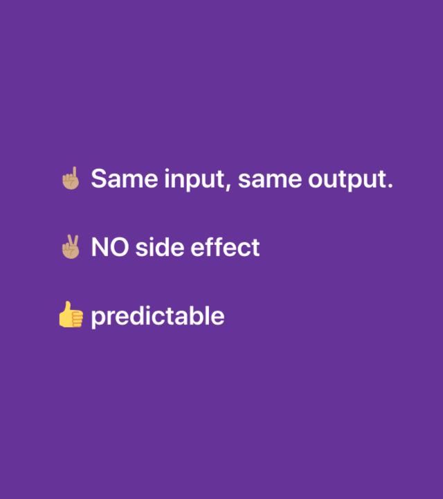
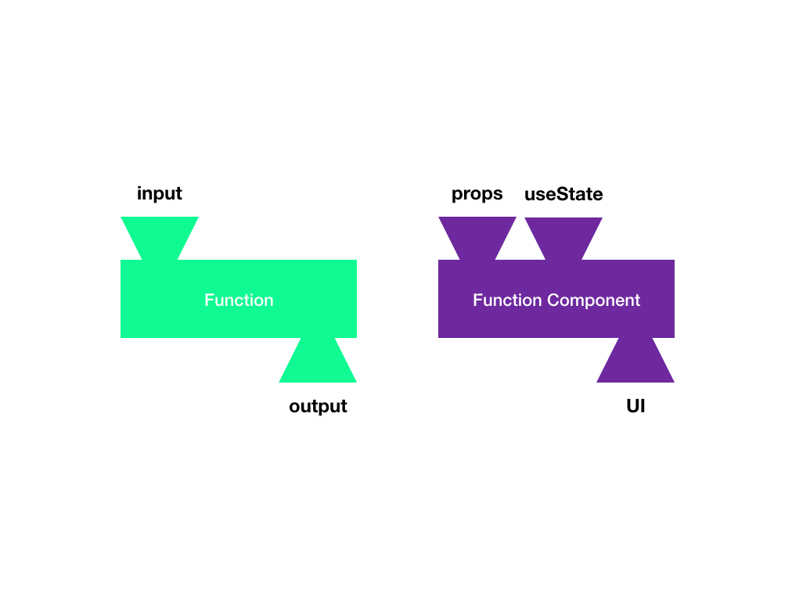

<style>
h1 {
  font-size: 60px;
  color: #282A36;
}

</style>

<!--  -->


# Pure function & Hooks

> Journey from "Pure function" to "Hooks"

---

<!-- paginate: true  -->


# Jong

- Jongeun Lee
- Organizer of JavaScript Developer Forum Korea (jsdev.kr)
- Fullstack Developer
- JavaScript ❤
- react-native, redux, parse-server, terraform, AWS... 🔎

---


# From &nbsp;&nbsp;&nbsp;&nbsp;&nbsp;&nbsp;&nbsp;&nbsp;&nbsp;&nbsp;&nbsp;&nbsp;&nbsp;&nbsp;&nbsp;&nbsp;&nbsp;&nbsp;&nbsp;&nbsp;&nbsp;&nbsp;&nbsp;&nbsp;&nbsp;&nbsp;&nbsp;&nbsp;&nbsp;&nbsp;&nbsp;&nbsp;&nbsp;&nbsp;&nbsp;&nbsp;&nbsp;to

#

#

#

#

#

#

#

#

#

---

> What is
> 

# 🤔 Function?

---

# Function

```javascript
function add(a, b) {
  return a + b;
}
add(1, 2);
```

- Input (arguments)
- Output (return value)

---

> What is
> 

# 🤔 Pure Function?

---

# Pure Function

## ☝🏽 Same input, same output.

## ✌🏽 NO side effect

---

# Why Pure Function?

## 👍 predictable

---

# If

## ☝🏽 Same input, same output.

## ✌🏽 NO side effect

# it is

## 👍 predictable


---

<!-- ## 왜 순수함수가 좋은가?

- 입력이 있을 때 결과를 예측할 수 있다.
- 예측하면 추가적으로 테스트를 쉽게 할 수 있다.
  - 예측이 충분히 되기에 예측과 다른지를 비교하도록 테스트 코드 작성
- memoization optimizing

---
-->

# 1. Pure?

```javascript
let c = 0;
function add(a, b) {
  return a + b + c;
}
```



---

# 1. Pure?

```javascript
let c = 0;
function add(a, b) {
  return a + b + c;
}
add(1, 2);
c = 3;
add(1, 2);
```


---

# 1-1. Pure!

<!-- As is:
```
function add(a, b) {
  return a + b + c;
}
``` -->

```javascript
function add(a, b, c) {
  return a + b + c;
}

//----------------------------

add(1, 2, 3);
add(1, 2, 4);
add(1, 2, 3);
```


---

# 2. Pure?

```javascript
let globals = {
  count: 0
};
function add(a, b) {
  globals.count++;
  return a + b;
}

//----------------------------

add(1, 2); // 3
add(1, 2); // 3
```


---

# 2. Pure?

```javascript
let globals = {
  count: 0
};
function add(a, b) {
  globals.count++;
  return a + b;
}

//----------------------------

add(1, 2); // 3
globals = undefined;
add(1, 2); // ??
```


---

# 2-1. Pure!

```javascript
function add(a, b, count) {
  return {
    value: a + b,
    count: count + 1
  };
}

//----------------------------

let myCount = 0;
const result = add(1, 2, myCount);
myCount = result.count;
```


---

# 2-2. Pure!

```javascript
function add(a, b, callback) {
  callback();
  return a + b;
}

//----------------------------

let count = 0;
add(1, 2, () => {
  count++;
}); // 3
```


<!-- sideffect means : The function changes something existed in outside of the function. -->

---

# 3. Pure?

```javascript
function add(args) {
  const result = args.left + args.right;
  args.left = 0;
  return result;
}

add({
  left: 1,
  right: 2
});
```


<!-- 함수를 만드는 사람과 함수를 사용하는 사람.
함수를 사용하는 사람은 함수 바깥에 영향을 줘도 된다.
함수를 만드는 사람이 만든 코드가 함수 바깥에 영향을 줘서는안된다.
다만 함수 실행시 함수 바깥에 영향을 줄 수 있는 방법을 제공할 수 있다. 이방법을 이용해서 바깥세상의 변화를 함수를 사용하는 사람이 정하는 것이다. -->

<!-- - What is the input?
- What is the output?
- Can you predict output?
  (함수를 예측가능하다는 말은 입력이 정해지면 결과가 뭐가 나오겠구나 예상할 수 있는것);
  (별도로 함수가 예측가능하다는게 뭔지를 설명하는 슬라이드가 있는게 좋겠다.) -->

<!-- # 2-3. Pure?

```javascript
  function add(props) {
    props.count++;
    return props.a + props.b;
  }
  const args = {
    a: 1,
    b: 2,
    count: 0
  }
  add(args);
```


--- -->

<!-- 함수를 사용하는 입장에서는 함수가 어떻게 구현되어서 어떻게 동작하는지 몰라도
이함수가 어떤 output을 주는지만 알고 사용하면 되는거지..
(요 말이랑 나중에 선언적 프로그래밍이랑 연결해주면 좋겠다.) -->

---

# If you want to make PURE function

## ☝🏽 Make an output value using input value.

<!-- - If function have to use data existed in outside of function, pass it as an input. -->

## ✌🏽 Do NOT change anything existed in outside of function.

<!-- - Do NOT change input also. -->

---

> For React Developer

# 🤔 Why understanding pure function is important?

---

# React ❤️ Functional programming

- Pure function
- Declarative

---

> Evidence 1.
>
> # Conceptually, <br/>components are like <br/>**_JavaScript functions_**.
>
> [reactjs.org/docs/components-and-props.html](https://reactjs.org/docs/components-and-props.html)

---

> Conceptually,

# Is this `Button` a function?

```xml
<Button title="Press Me" color="green" onPress={this.onPress} />
```

> ### Function is "`using _____, make ______`"

<!-- > input, output -->
<!-- button on the screen -->

---

```xml
<Button title="Press Me" color="green" onPress={this.onPress} />
```

| input                 | output                                                       |
| --------------------- | ------------------------------------------------------------ |
| title, color, onPress | <button style="color:green;font-size:25px">Press Me</button> |

---

> Evidence 2.
>
> # All React components <br/>must act like **_pure functions_** <br/>with respect to their props.

[reactjs.org/docs/components-and-props.html](https://reactjs.org/docs/components-and-props.html)

---

# Pure Function?

```javascript
const MyH1 = ({ title }) => {
  return <h1 style={{ color: 'red' }}>{title}</h1>;
};
```


---

# PURE!

## same `props` makes same UI

```xml
<MyH1 title="I love Bali"/>
<MyH1 title="I love Bali"/>
```

<h1 style="color:red;font-size:40px;margin:0">I love Bali</h1>
<h1 style="color:red;font-size:40px;margin:0">I love Bali</h1>

---

> pure function

# 👍 Pros.

## 1. Test

## 2. Performance

Because it is predictable.


---

# Output?

```javascript
function specialCrazyCalculator(a, b) {
  return Math.floor(Math.asin((a + b) / (a + b + 1) / 10) * 123.44566834);
}
specialCrazyCalculator(1, 2);
```

---

> Speed quiz

# What is return value?

```javascript
specialCrazyCalculator(1, 2);
```

---

# Test code

```javascript
test('specialCrazyCalculator', () => {
  expect(specialCrazyCalculator(1, 2)).toBe(9);
});
```

---

> pure function

# 👍 Pros.

## 1. Test

## 2. Performance

Because it is predictable.


---

> ~~pure~~ function

# Cons.

## Can not remember anything by itself

> In other words, It doesn't have state.


---

# 🔎 CounterButton Example

---

# 🤔 Which one has to count?

1. `CounterButton`
2. Parent component of `CounterButton`

---

# Move `count` state<br/>to `CounterButton` component

<!--
####
### 중요!!!

클래스 기반의 countbutton을 function 형으로 바꿔보자.
자 그리고 우리가 아까 배운 방법대로 pure하면서 입력으로 죄다 받도록 해보자.
부모가 모든 입력을 준다.
잠깐 그런데 사실 카운팅은 누구의 역할인가? 부모가 할 역할인가? 이름에서 알수 있듯이 카운팅하는것은 countbutton의 역할이다
그럼 이 카운팅은 누가해야할 일인가?
이 때 해결 해줄수 있는 바로 hook이다.

그럼 이 hook으로 바꿔보자.
그럼 이 바꾼 함수는 순수하다 할수 있는가?
- 순수하지 않다!
- 하지만 컨셉추얼리 순수하다 할 수 있다.

생각을 조금만 바꿔보자.
인풋 : props, state
output : UI
이 함수는 순수한가?

props : 부모가 넘겨줄만한 인풋
state : 컴포넌트가 알아서 가져와야할 인풋


글 목록에서 글을 골라야하고
글의 본문을 읽어와야하는데

DetailView를 만든다고 해보자 인풋이 뭘까?

글목록이 있고 detailView가


 -->

---

# Hook


---

## We don't know what is `useState` yet.

# Try `useState`

---


# Pure or Impure

```javascript
const CounterButton = ({ title }) => {
  const [count, setCount] = useState(0);
  return (
    <button
      onClick={() => {
        setCount(count + 1);
      }}
    >
      {title} : {count}
    </button>
  );
};
```

</font>

---

# But conceptually PURE!

#

#

#

#

#

#

#

#

#



---

<!-- _backgroundColor: #FF7E79 -->

<font style="font-size:80px;font-weight:bold;color:white">🤩 useState(hook) is<br/> another input</font>

---

# 3. Pure?

> `props`, `useState` are input

```javascript
const CounterButton = ({ title }) => {
  const [count, setCount] = useState(0);
  return (
    <button
      onClick={() => {
        setCount(count + 1);
      }}
    >
      {title} : {count}
    </button>
  );
};
```


<!-- ---

# Hooks are functions<br/>that let you “hook into”<br/>**_React state_** and **_lifecycle features_**<br/>from function components.

https://reactjs.org/docs/hooks-overview.html#but-what-is-a-hook -->

<!-- ---

> In other words, Hook

# It makes your function components can **_remember something_**. -->

---

<!-- ## - It can trigger rendering.

## - Run some code

- when demount
- after rendering
- ...

--- -->


# Wanna **_Remember_** something and **_Re-render_** when it changes?

## `const [count, setCount] = useState(0)`

- `[0]` : Stored value or initial value. you can NOT change it directly.
- `[1]` : A Function that changes the value and triggers re-rendering

<!-- ---


# Remember something, ~~and re-render when it changed~~

## `const myRef = useRef(0)`

- `current` property : Stored value, you can change it directly.

```javascript
const myRef = useRef(0);
myRef.current;
``` -->

---


# Wanna make some **_changes_** **_outside of function_**?

## `useEffect()`

<!-- - Do something, outside of function -->

- After rendering, do **_something_**
- For example
  - `setTimeout`, `setInterval`
  - subscribe
  - data fetching
  - imperative API

<!-- ---

# `useEffect` remembers

- clean up function
- previous dependencies array -->

---

# More built-in hooks

- useContext
- useReducer
- useCallback
- useMemo
  ...

---

## ⌨️ LIVE CODING

# Custom Hook

> In other words, **Custom Input**


---

<!-- _backgroundColor: #FF7E79 -->

<font style="font-size:100px;font-weight:bold;color:white">🏄🏽‍♀️ Summary</font>

---

# 💧Pure Function


---


# `Props` and `useState` are input of<br/>**_Function Component_**

---


# `Props` : input from **_Parent_** Component

# `useState` : input from **_Hook_**

---

<!-- _backgroundColor: #FF7E79 -->

# 🇰🇷 ❤️ 🇮🇩

<font style="font-size:100px;font-weight:bold;color:white">🙏 Terima kasih banyak</font>
twitter / GitHub : @yomybaby

---

# Refs

- Images
  - function : https://en.wikipedia.org/wiki/Function_(mathematics)#/media/File:Function_machine2.svg
  - Pure water : https://www.piqsels.com/en/public-domain-photo-jfecp
  - Hook Lego : https://www.amazon.com/LEGO-Disney-Collectible-Minifigure-Captain/dp/B01F1FNLWC
  - typing gif : https://media.giphy.com/media/lCbSAbRrFEfkY/giphy.gif
  - Other images (except emoji) by [Jong Eun Lee](https://github.com/yomybaby) under CC0 License
